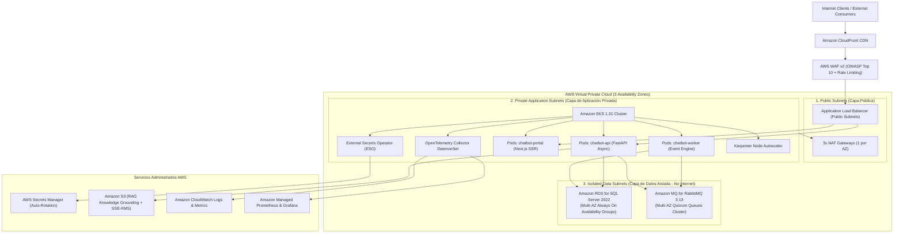

# ADR 0013: Matriz de Requerimientos de Infraestructura Cloud en AWS (Arquitectura 3-Tier, EKS, RDS SQL Server 2022 y Amazon MQ)

- **Estado:** Aceptado (Accepted)
- **Fecha:** 2026-10-03
- **Autores:** Core Architecture & Platform Engineering Team
- **Contexto:** Rama `feat/infra-pipelines-and-repo-standardization` — Sección 5 de RFC 01 (`docs/roadmap/rfc/rfc_infra_pipelines_and_provisioning_spec.md`) y provisión en `infra/provisioning/aws/`

---

## 1. Contexto y Problemática

La plataforma `ai-conversation-platform` ha consolidado su arquitectura técnica local sobre contenedores Docker Compose estandarizados (ADR 0010), gestión robusta de configuración con Pydantic Settings (ADR 0011) y pipelines modulares con Service Containers en CI/CD (ADR 0012). 

Para garantizar la transición predecible hacia entornos cloud empresariales gestionados mediante Infraestructura como Código (IaC con Terraform en `infra/provisioning/aws`) y GitOps con ArgoCD, es imperativo establecer formalmente:

1. **Topología de Red Segura y Aislada:**
   - La plataforma maneja flujos conversacionales, embeddings vectoriales, llamadas a herramientas en sandboxes (ADR 0007), orquestación multi-agente (ADR 0008) y gobernanza de IA (ADR 0009). Requiere un aislamiento perimetral estricto en 3 capas de subredes (VPC 3-tier) que impida el acceso directo desde internet a la base de datos o al broker de mensajería.
2. **Paridad Estricta de Motores Cloud con el Entorno Local y CI:**
   - **RDBMS:** Microsoft SQL Server 2022 es el motor canónico de persistencia relacional y vectorial. El servicio cloud debe ser **Amazon RDS for SQL Server 2022** con soporte para transacciones ACID, tipos de datos específicos de T-SQL, migraciones nativas de Alembic y vector search.
   - **Message Broker:** RabbitMQ 3.13 es el motor de streaming asíncrono y desacoplamiento de eventos (`aio-pika`, topic exchanges, dead-letter exchanges). El servicio cloud debe ser **Amazon MQ for RabbitMQ 3.13**.
3. **Diferenciación de Entornos (Non-Prod vs. Producción Enterprise):**
   - Evitar sobrecostos desproporcionados en entornos de Staging/QA manteniendo a la vez una configuración de alta disponibilidad (Multi-AZ), resiliencia y disaster recovery en Producción que cumpla con los SLAs contractuales.

---

## 2. Decisión de Diseño

Se adopta una **Arquitectura Cloud 3-Tier en Amazon Web Services (AWS)** sustentada en Terraform y Kubernetes (Amazon EKS 1.31), con la siguiente matriz de especificaciones técnicas:

### 2.1. Topología de Red en 3 Capas (3-Tier VPC)



1. **Capa Pública (`public`):**
   - Aloja exclusivamente los Application Load Balancers (ALB) y los NAT Gateways.
   - Protegida por AWS WAF v2 con inspección perimetral.
2. **Capa de Aplicación Privada (`private_app`):**
   - Aloja el cluster de **Amazon EKS 1.31** con los pods de `api`, `worker` y `portal`.
   - Salida a internet permitida exclusivamente a través de los NAT Gateways (para invocar proveedores de LLM como Google Gemini, OpenAI o Anthropic).
3. **Capa de Datos Aislada (`private_data`):**
   - Aloja **Amazon RDS for SQL Server 2022** y **Amazon MQ for RabbitMQ 3.13**.
   - Subredes estrictamente aisladas sin rutas hacia NAT Gateways ni Internet Gateways. Conexiones permitidas únicamente desde los Security Groups del cluster EKS.

---

### 2.2. Matriz Dual de Requerimientos: Mínimos vs. Ideales

| Dimensión | Requerimientos Mínimos (Non-Prod / Staging) | Requerimientos Ideales (Producción Enterprise) |
| :--- | :--- | :--- |
| **Cómputo (Kubernetes / Containers)** | **Amazon EKS 1.31**:<br>- 1 Managed Node Group<br>- 2 nodos `t3.xlarge` (8 vCPU, 32 GiB total)<br>- Single AZ o Multi-AZ básica (2 AZs)<br>- Horizontal Pod Autoscaler (HPA) estándar | **Amazon EKS 1.31** con alta densidad y elasticidad:<br>- **Karpenter** para auto-escalado instantáneo de pods basado en demandas de CPU/Memoria<br>- Nodos de cómputo `m6i.xlarge` / `c6i.xlarge` distribuidos uniformemente en 3 AZs<br>- Pod Disruption Budgets (PDB) y Topology Spread Constraints para tolerancia a fallas de zona |
| **Base de Datos Relacional y Vectorial (RDBMS)** | **Amazon RDS for SQL Server 2022** (Web o Standard Edition):<br>- Instancia `db.t3.xlarge` (4 vCPU, 16 GiB)<br>- Despliegue Single-AZ con Storage GP3 (50 GB)<br>- Backups automáticos con retención de 7 días<br>- Cifrado en reposo con AWS KMS | **Amazon RDS for SQL Server 2022** (Standard o Enterprise Edition):<br>- **Despliegue Multi-AZ con Always On Availability Groups** (failover síncrono automático sin pérdida de datos)<br>- Instancia `db.r6i.2xlarge` (8 vCPU, 64 GiB memoria optimizada para caché T-SQL y operaciones vectoriales)<br>- Storage GP3/IO2 provisionado con auto-scaling hasta 1 TB<br>- Read Replicas dedicadas para consultas analíticas pesadas<br>- Point-In-Time Recovery (PITR) continuo a 35 días |
| **Message Broker (Eventos y Streaming)** | **Amazon MQ for RabbitMQ 3.13**:<br>- Despliegue Single-Broker `mq.m5.large`<br>- Almacenamiento EBS persistente estándar<br>- Conexión TLS encriptada vía AMQPS (puerto 5671) | **Amazon MQ for RabbitMQ 3.13**:<br>- **Cluster Multi-AZ (3 nodos con Quorum Queues)** para alta tolerancia a particiones de red<br>- Instancia `mq.m5.xlarge`<br>- Políticas de Dead Letter Exchange (DLX) y TTL configuradas de forma idéntica a local<br>- Almacenamiento EBS optimizado de alta velocidad |
| **Almacenamiento de Documentos y RAG** | **Amazon S3 Standard**:<br>- Bucket privado para ingesta de documentos y chunks<br>- Cifrado SSE-S3 o SSE-KMS gestionado | **Amazon S3 Enterprise**:<br>- Versionado obligatorio y **Object Lock (Compliance Mode)** para inmutabilidad de fuentes de conocimiento<br>- Cifrado forzado SSE-KMS con Custom KMS Key y rotación anual automática<br>- Políticas de ciclo de vida (Intelligent-Tiering hacia Glacier tras 90 días) |
| **Gestión de Secretos y Parámetros** | **AWS Systems Manager Parameter Store** (SecureString con KMS) para configuración general y secretos no críticos. | **AWS Secrets Manager** con rotación programada automática para credenciales de SQL Server y tokens de LLMs.<br>Integración nativa en EKS mediante **External Secrets Operator (ESO)** sincronizando hacia Kubernetes Secrets en memoria. |
| **Red y Seguridad Perimetral** | - VPC en 2 Availability Zones (`us-east-1a`, `us-east-1b`)<br>- 1 NAT Gateway compartido (optimización de costos)<br>- Security Groups con reglas cerradas por puerto | - VPC en 3 Availability Zones (`us-east-1a`, `us-east-1b`, `us-east-1c`)<br>- **3 NAT Gateways independientes** (resiliencia ante caída de AZ)<br>- **AWS WAF v2** asociado al ALB con:<br>  * Reglas administradas OWASP Core Rule Set (CRS)<br>  * Protección contra inyecciones SQL y XSS<br>  * Rate Limiting agresivo por IP (100 req/min por cliente) |
| **Observabilidad y Auditoría** | - CloudWatch Logs estándar (retención 14 días)<br>- Métricas básicas de CPU y memoria de pods y base de datos | - **OpenTelemetry Collector** desplegado como DaemonSet en EKS recolectando métricas, trazas y logs.<br>- Ingesta de trazas distribuidas W3C en AWS X-Ray / Grafana Tempo.<br>- Métricas en **Amazon Managed Service for Prometheus (AMP)** y tableros en **Amazon Managed Grafana (AMG)**.<br>- CloudWatch Logs con retención de 90 días y exportación automática a S3 Glacier para cumplimiento y auditoría forense. |
| **Objetivos de Resiliencia y SLA** | **SLA Objetivo: 99.5%**<br>RTO (Recovery Time Objective): 4 horas<br>RPO (Recovery Point Objective): 1 hora | **SLA Objetivo: 99.95%**<br>RTO: **< 15 minutos** (failover automático Multi-AZ)<br>RPO: **< 5 minutos** (cero pérdida de datos para transacciones confirmadas) |

---

### 2.3. Mapeo con los Módulos de Terraform (`infra/provisioning/aws/`)

La estructura modular de Terraform en el monorepo se alinea de la siguiente manera:

```text
infra/provisioning/aws/
├── README.md                          # Guía principal de aprovisionamiento y contratos
├── modules/
│   ├── network/                       # VPC, Subnets (public, private_app, private_data), NAT GWs, Route Tables
│   ├── eks/                           # EKS Control Plane 1.31, IAM Roles for Service Accounts (IRSA), VPC CNI
│   ├── ecr/                           # Registries de contenedores: chatbot-api, chatbot-worker, chatbot-portal
│   ├── rds_mssql/                     # (Módulo target) RDS SQL Server 2022 Multi-AZ Always On, KMS, Parameter Groups
│   └── amazon_mq/                     # (Módulo target) Amazon MQ RabbitMQ 3.13 Quorum Cluster, Security Groups
├── shared/platform/                   # Bootstrap compartida: State backend S3, DynamoDB lock, IAM base
├── nonprod/                           # Terraform root para QA/Staging (configuración mínima / costo contenido)
└── prod/                              # Terraform root para Producción Enterprise (Multi-AZ, Always On, WAF v2)
```

---

## 3. Consecuencias y Beneficios

### Positivas
- **Alineación 100% Sin Desfase de Comportamiento:** Se mantiene exactamente la misma semántica de motor relacional (SQL Server 2022) y broker de mensajería (RabbitMQ 3.13) validada en las suites de pruebas de CI/CD (ADR 0012) y Compose local (ADR 0010).
- **Aislamiento de Seguridad de Grado Bancario / Enterprise:** Las bases de datos y colas de eventos residen en subredes sin acceso a internet, impidiendo cualquier vector de exfiltración o ataque directo externo.
- **Preparación para Cumplimiento Normativo (SOC2 / ISO 27001):** El cifrado KMS obligatorio en reposo y tránsito, el Object Lock en S3, la retención de logs de auditoría y la rotación automática de secretos facilitan certificaciones de seguridad.

### Trade-offs y Mitigaciones
- **Costos de Licenciamiento en Producción:** Las licencias de SQL Server Standard/Enterprise en RDS con Always On Multi-AZ tienen un costo representativo.
  - *Mitigación:* En entornos de Non-Prod (QA/Staging) se utiliza Web Edition o Standard en Single-AZ sobre instancias de menor tamaño (`db.t3.xlarge`), conteniendo el gasto mensual de infraestructura.
- **Costo de Tráfico Inter-AZ y Múltiples NAT Gateways:**
  - *Mitigación:* Se provisionan 3 NAT Gateways exclusivamente en Producción para garantizar la tolerancia a fallos por zona. En Non-Prod se utiliza un único NAT Gateway compartido.

---

## 4. Checklist de Conformidad y Estado

- [x] **Topología 3-Tier VPC formalizada:** Subredes pública, aplicación y datos aislada especificadas en arquitectura.
- [x] **Paridad de Motores garantizada:** RDS SQL Server 2022 y Amazon MQ RabbitMQ 3.13 definidos como estándares cloud no negociables.
- [x] **Matriz Dual especificada:** Dimensionamiento Mínimo (Non-Prod) vs. Ideal (Prod) documentado en RFC 01 y ADR 0013.
- [x] **Mapeo de Terraform sincronizado:** Estructura modular en `infra/provisioning/aws/` alineada con los requisitos de la plataforma.
- [x] **SLA / RTO / RPO aprobados:** 99.95% de disponibilidad, RTO < 15 min y RPO < 5 min establecidos para Producción.
