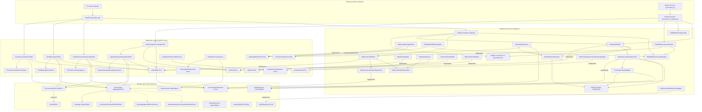

# System Map

```mermaid
graph TD

    subgraph Interfaces ["Interfaces (Driver Adapters)"]
        RouterFastAPI["FastAPI App (build_api)"]
        CLIExport["CLI export-openapi"]
        WorkerProcess["Worker Process (src/worker.py)"]
        WorkerContainerNode["WorkerContainer (src/worker_container.py)"]
    end

    subgraph Application ["Application Layer (CQRS & Ports)"]
        CreateConvCmd["CreateConversationCommand"]
        CreateConvHandler["CreateConversationHandler"]
        SendMessageCmd["SendMessageCommand"]
        SendMessageHandler["SendMessageHandler"]
        AppendAssistantCmd["AppendAssistantMessageCommand"]
        AppendAssistantHandler["AppendAssistantMessageHandler"]
        StreamConvQuery["StreamConversationQuery"]
        StreamConvHandler["StreamConversationQueryHandler"]
        UOWPort["UnitOfWork Port"]
        LLMClientPort["LlmClientPort"]
        EventPubPort["EventPublisherPort"]
        HTTPClientPort["HttpClientPort"]
        MsgBrokerPort["MessageBrokerPort (Port)"]
        EventConsumerPortNode["EventConsumerPort (Port)"]
        WorkerHandlerNode["LlmMessageProcessingWorker"]
        IdempotencyRepoPort["IdempotencyRepository (Port)"]
        StreamBufferRepoPort["StreamBufferRepository (Port)"]
        IdempotentExecutor["IdempotentCommandExecutor"]
        StreamRecoveryServiceNode["StreamRecoveryService"]
    end

    subgraph Domain ["Domain Layer (Core Business)"]
        ConvAggregate["Conversation (AggregateRoot)"]
        MessageVO["Message (ValueObject)"]
        ConvCreatedEvent["ConversationCreatedDomainEvent"]
        MsgAppendedEvent["MessageAppendedDomainEvent"]
        AssistantCompletedEvent["AssistantResponseCompletedDomainEvent"]
        ConvRepoPort["ConversationRepository (Port)"]
        ConvNotFoundErr["ConversationNotFoundError"]
        DomainError["DomainError"]
        EventEnvelopeVO["EventEnvelope (ValueObject)"]
        IdempotencyKeyVO["IdempotencyKey (ValueObject)"]
        StreamChunkVO["StreamChunk (ValueObject)"]
        AuditLogEntity["AuditLogRecord (Entity)"]
        AuditRepoPort["AuditRepository (Port)"]
    end

    subgraph Infrastructure ["Infrastructure (Driven Adapters)"]
        InMemoryUOW["InMemoryUnitOfWork"]
        InMemoryRepo["InMemoryConversationRepository"]
        HttpxClient["HttpxClientAdapter"]
        InMemoryOutbox["InMemoryOutboxRepository"]
        OutboxDispatcher["OutboxDispatcher"]
        FakeLlmClient["FakeLlmClientAdapter"]
        HttpxLlmClient["HttpxLlmClientAdapter"]
        MssqlModels["MSSQL Models (SQLModel)"]
        ConversationMapper["ConversationDataMapper"]
        MssqlConnection["MSSQL Connection & SessionFactory"]
        MssqlRepo["MssqlConversationRepository"]
        MssqlOutbox["MssqlOutboxRepository"]
        MssqlUOW["MssqlUnitOfWork"]
        InMemoryMsgBroker["InMemoryMessageBroker"]
        RabbitMQConnManager["RabbitMQConnectionManager"]
        RabbitMQTopology["RabbitMQTopologyConfig"]
        RabbitMQPub["RabbitMQPublisherAdapter"]
        RabbitMQConsumer["RabbitMQConsumerAdapter"]
        OutboxRelay["OutboxRelayService"]
        InMemoryIdempotencyRepo["InMemoryIdempotencyRepositoryAdapter"]
        InMemoryAuditRepo["InMemoryAuditRepositoryAdapter"]
        AppSettings["Settings (Pydantic Settings)"]
    end

    %% Interfaces to Application
    CLIExport --> RouterFastAPI
    RouterFastAPI --> CreateConvHandler
    RouterFastAPI --> SendMessageHandler
    RouterFastAPI --> StreamConvHandler
    RouterFastAPI --> AppSettings

    %% Application orchestration
    CreateConvHandler --> CreateConvCmd
    CreateConvHandler --> ConvAggregate
    CreateConvHandler --> UOWPort

    SendMessageHandler --> SendMessageCmd
    SendMessageHandler --> ConvAggregate
    SendMessageHandler --> ConvNotFoundErr
    SendMessageHandler --> UOWPort

    AppendAssistantHandler --> AppendAssistantCmd
    AppendAssistantHandler --> ConvAggregate
    AppendAssistantHandler --> ConvNotFoundErr
    AppendAssistantHandler --> UOWPort

    StreamConvHandler --> StreamConvQuery
    StreamConvHandler --> ConvRepoPort
    StreamConvHandler --> ConvNotFoundErr
    StreamConvHandler --> LLMClientPort
    IdempotentExecutor --> IdempotencyRepoPort
    StreamRecoveryServiceNode --> StreamBufferRepoPort
    StreamRecoveryServiceNode --> StreamChunkVO

    %% Domain Relationships
    ConvAggregate --> MessageVO
    ConvAggregate -.-> ConvCreatedEvent
    ConvAggregate -.-> MsgAppendedEvent
    ConvAggregate -.-> AssistantCompletedEvent
    ConvNotFoundErr -- Deriva de --> DomainError

    %% Application to Domain Ports
    UOWPort --> ConvRepoPort

    %% Infrastructure Implementations
    AppSettings --> MssqlConnection
    AppSettings --> MssqlUOW
    AppSettings --> InMemoryUOW
    InMemoryUOW -- Implementa --> UOWPort
    InMemoryRepo -- Implementa --> ConvRepoPort
    InMemoryUOW --> InMemoryRepo
    InMemoryUOW --> InMemoryOutbox
    MssqlUOW -- Implementa --> UOWPort
    MssqlRepo -- Implementa --> ConvRepoPort
    MssqlUOW --> MssqlRepo
    MssqlUOW --> MssqlOutbox
    MssqlUOW --> MssqlConnection
    MssqlRepo --> ConversationMapper
    MssqlRepo --> MssqlModels
    MssqlOutbox --> MssqlModels
    OutboxDispatcher --> InMemoryOutbox
    OutboxDispatcher --> EventPubPort
    FakeLlmClient -- Implementa --> LLMClientPort
    HttpxLlmClient -- Implementa --> LLMClientPort
    HttpxClient -- Implementa --> HTTPClientPort
    InMemoryMsgBroker -- Implementa --> MsgBrokerPort
    InMemoryMsgBroker -- Implementa --> EventConsumerPortNode
    RabbitMQPub -- Implementa --> MsgBrokerPort
    RabbitMQConsumer -- Implementa --> EventConsumerPortNode
    RabbitMQPub --> RabbitMQConnManager
    RabbitMQConsumer --> RabbitMQConnManager
    OutboxRelay --> MssqlOutbox
    OutboxRelay --> MsgBrokerPort
    OutboxRelay --> EventEnvelopeVO
    ConversationMapper --> MssqlModels
    ConversationMapper --> ConvAggregate
    MssqlRepo --> EventEnvelopeVO
    WorkerProcess --> WorkerContainerNode
    WorkerContainerNode --> WorkerHandlerNode
    WorkerContainerNode --> RabbitMQConsumer
    WorkerContainerNode --> RabbitMQTopology
    WorkerContainerNode --> MssqlUOW
    WorkerHandlerNode --> AppendAssistantHandler
    WorkerHandlerNode --> LLMClientPort
    WorkerHandlerNode --> UOWPort
    AppSettings --> RabbitMQConnManager
    InMemoryIdempotencyRepo -- Implementa --> IdempotencyRepoPort
    InMemoryAuditRepo -- Implementa --> AuditRepoPort
```
