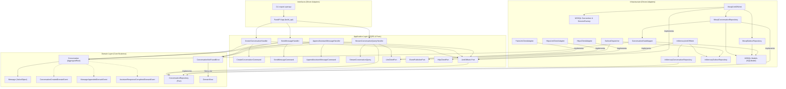

# System Map

```mermaid
graph TD

    subgraph Interfaces ["Interfaces (Driver Adapters)"]
        RouterFastAPI["FastAPI App (build_api)"]
        CLIExport["CLI export-openapi"]
    end

    subgraph Application ["Application Layer (CQRS & Ports)"]
        CreateConvCmd["CreateConversationCommand"]
        CreateConvHandler["CreateConversationHandler"]
        SendMessageCmd["SendMessageCommand"]
        SendMessageHandler["SendMessageHandler"]
        AppendAssistantCmd["AppendAssistantMessageCommand"]
        AppendAssistantHandler["AppendAssistantMessageHandler"]
        StreamConvQuery["StreamConversationQuery"]
        StreamConvHandler["StreamConversationQueryHandler"]
        UOWPort["UnitOfWork Port"]
        LLMClientPort["LlmClientPort"]
        EventPubPort["EventPublisherPort"]
        HTTPClientPort["HttpClientPort"]
    end

    subgraph Domain ["Domain Layer (Core Business)"]
        ConvAggregate["Conversation (AggregateRoot)"]
        MessageVO["Message (ValueObject)"]
        ConvCreatedEvent["ConversationCreatedDomainEvent"]
        MsgAppendedEvent["MessageAppendedDomainEvent"]
        AssistantCompletedEvent["AssistantResponseCompletedDomainEvent"]
        ConvRepoPort["ConversationRepository (Port)"]
        ConvNotFoundErr["ConversationNotFoundError"]
        DomainError["DomainError"]
    end

    subgraph Infrastructure ["Infrastructure (Driven Adapters)"]
        InMemoryUOW["InMemoryUnitOfWork"]
        InMemoryRepo["InMemoryConversationRepository"]
        HttpxClient["HttpxClientAdapter"]
        InMemoryOutbox["InMemoryOutboxRepository"]
        OutboxDispatcher["OutboxDispatcher"]
        FakeLlmClient["FakeLlmClientAdapter"]
        HttpxLlmClient["HttpxLlmClientAdapter"]
        MssqlModels["MSSQL Models (SQLModel)"]
        ConversationMapper["ConversationDataMapper"]
        MssqlConnection["MSSQL Connection & SessionFactory"]
        MssqlRepo["MssqlConversationRepository"]
        MssqlOutbox["MssqlOutboxRepository"]
        MssqlUOW["MssqlUnitOfWork"]
    end

    %% Interfaces to Application
    CLIExport --> RouterFastAPI
    RouterFastAPI --> CreateConvHandler
    RouterFastAPI --> SendMessageHandler
    RouterFastAPI --> StreamConvHandler

    %% Application orchestration
    CreateConvHandler --> CreateConvCmd
    CreateConvHandler --> ConvAggregate
    CreateConvHandler --> UOWPort

    SendMessageHandler --> SendMessageCmd
    SendMessageHandler --> ConvAggregate
    SendMessageHandler --> ConvNotFoundErr
    SendMessageHandler --> UOWPort

    AppendAssistantHandler --> AppendAssistantCmd
    AppendAssistantHandler --> ConvAggregate
    AppendAssistantHandler --> ConvNotFoundErr
    AppendAssistantHandler --> UOWPort

    StreamConvHandler --> StreamConvQuery
    StreamConvHandler --> ConvRepoPort
    StreamConvHandler --> ConvNotFoundErr
    StreamConvHandler --> LLMClientPort

    %% Domain Relationships
    ConvAggregate --> MessageVO
    ConvAggregate -.-> ConvCreatedEvent
    ConvAggregate -.-> MsgAppendedEvent
    ConvAggregate -.-> AssistantCompletedEvent
    ConvNotFoundErr -- Deriva de --> DomainError

    %% Application to Domain Ports
    UOWPort --> ConvRepoPort

    %% Infrastructure Implementations
    InMemoryUOW -- Implementa --> UOWPort
    InMemoryRepo -- Implementa --> ConvRepoPort
    InMemoryUOW --> InMemoryRepo
    InMemoryUOW --> InMemoryOutbox
    MssqlUOW -- Implementa --> UOWPort
    MssqlRepo -- Implementa --> ConvRepoPort
    MssqlUOW --> MssqlRepo
    MssqlUOW --> MssqlOutbox
    MssqlUOW --> MssqlConnection
    MssqlRepo --> ConversationMapper
    MssqlRepo --> MssqlModels
    MssqlOutbox --> MssqlModels
    OutboxDispatcher --> InMemoryOutbox
    OutboxDispatcher --> EventPubPort
    FakeLlmClient -- Implementa --> LLMClientPort
    HttpxLlmClient -- Implementa --> LLMClientPort
    HttpxClient -- Implementa --> HTTPClientPort
    ConversationMapper --> MssqlModels
    ConversationMapper --> ConvAggregate
```
