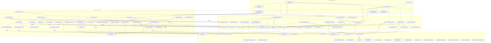

# System Map

```mermaid
graph TD

    subgraph Interfaces ["Interfaces (Driver Adapters)"]
        AppContainerNode["AppContainer (src/container.py)"]
        RouterFastAPI["FastAPI App (build_api)"]
        IdempotencyDep["Idempotency Header Dependency"]
        ResumableSSE["Resumable SSE Endpoint (messages_router)"]
        CLIExport["CLI export-openapi"]
        WorkerProcess["Worker Process (src/worker.py)"]
        WorkerContainerNode["WorkerContainer (src/worker_container.py)"]
    end

    subgraph Application ["Application Layer (CQRS & Ports)"]
        CreateConvCmd["CreateConversationCommand"]
        CreateConvHandler["CreateConversationHandler"]
        SendMessageCmd["SendMessageCommand"]
        SendMessageHandler["SendMessageHandler"]
        AppendAssistantCmd["AppendAssistantMessageCommand"]
        AppendAssistantHandler["AppendAssistantMessageHandler"]
        StreamConvQuery["StreamConversationQuery"]
        StreamConvHandler["StreamConversationQueryHandler"]
        UOWPort["UnitOfWork Port"]
        LLMClientPort["LlmClientPort"]
        EventPubPort["EventPublisherPort"]
        HTTPClientPort["HttpClientPort"]
        MsgBrokerPort["MessageBrokerPort (Port)"]
        EventConsumerPortNode["EventConsumerPort (Port)"]
        WorkerHandlerNode["LlmMessageProcessingWorker"]
        IdempotencyRepoPort["IdempotencyRepository (Port)"]
        StreamBufferRepoPort["StreamBufferRepository (Port)"]
        IdempotentExecutor["IdempotentCommandExecutor"]
        StreamRecoveryServiceNode["StreamRecoveryService"]
        ResumeStreamQueryNode["ResumeStreamQuery"]
        ResumeStreamHandlerNode["ResumeStreamQueryHandler"]
        TenantContextNode["TenantContext (src/application/shared/tenancy)"]
        ModelRouterServiceNode["ModelRouterService"]
        ReserveQuotaCmd["ReserveQuotaCommand"]
        ReserveQuotaHandler["ReserveQuotaCommandHandler"]
        SettleQuotaCmd["SettleQuotaCommand"]
        SettleQuotaHandler["SettleQuotaCommandHandler"]
    end

    subgraph Domain ["Domain Layer (Core Business)"]
        ConvAggregate["Conversation (AggregateRoot)"]
        MessageVO["Message (ValueObject)"]
        ConvCreatedEvent["ConversationCreatedDomainEvent"]
        MsgAppendedEvent["MessageAppendedDomainEvent"]
        AssistantCompletedEvent["AssistantResponseCompletedDomainEvent"]
        ConvRepoPort["ConversationRepository (Port)"]
        ConvNotFoundErr["ConversationNotFoundError"]
        DomainError["DomainError"]
        EventEnvelopeVO["EventEnvelope (ValueObject)"]
        IdempotencyKeyVO["IdempotencyKey (ValueObject)"]
        StreamChunkVO["StreamChunk (ValueObject)"]
        AuditLogEntity["AuditLogRecord (Entity)"]
        AuditRepoPort["AuditRepository (Port)"]
        TenantIdVO["TenantId (ValueObject)"]
        MonetaryBudgetVO["MonetaryBudget (ValueObject)"]
        ModelRouteVO["ModelRoute (ValueObject)"]
        TenantAggregate["Tenant (AggregateRoot)"]
        TenantPolicyEntity["TenantPolicy (Entity)"]
        TenantBudgetReservedEvent["TenantBudgetReservedDomainEvent"]
        TenantBudgetSettledEvent["TenantBudgetSettledDomainEvent"]
        TenantQuotaExceededEvent["TenantQuotaExceededDomainEvent"]
        TenantSuspendedEvent["TenantSuspendedDomainEvent"]
        FallbackActivatedEvent["ModelRouteFallbackActivatedDomainEvent"]
        TenantRepoPort["TenantRepositoryPort (Port)"]
        ModelCatalogPortNode["ModelCatalogPort (Port)"]
    end

    subgraph Infrastructure ["Infrastructure (Driven Adapters)"]
        InMemoryUOW["InMemoryUnitOfWork"]
        InMemoryRepo["InMemoryConversationRepository"]
        HttpxClient["HttpxClientAdapter"]
        InMemoryOutbox["InMemoryOutboxRepository"]
        OutboxDispatcher["OutboxDispatcher"]
        FakeLlmClient["FakeLlmClientAdapter"]
        HttpxLlmClient["HttpxLlmClientAdapter"]
        MssqlModels["MSSQL Models (SQLModel)"]
        ConversationMapper["ConversationDataMapper"]
        MssqlConnection["MSSQL Connection & SessionFactory"]
        MssqlRepo["MssqlConversationRepository"]
        MssqlOutbox["MssqlOutboxRepository"]
        MssqlUOW["MssqlUnitOfWork"]
        InMemoryMsgBroker["InMemoryMessageBroker"]
        RabbitMQConnManager["RabbitMQConnectionManager"]
        RabbitMQTopology["RabbitMQTopologyConfig"]
        RabbitMQPub["RabbitMQPublisherAdapter"]
        RabbitMQConsumer["RabbitMQConsumerAdapter"]
        OutboxRelay["OutboxRelayService"]
        InMemoryIdempotencyRepo["InMemoryIdempotencyRepositoryAdapter"]
        InMemoryAuditRepo["InMemoryAuditRepositoryAdapter"]
        MssqlIdempotencyRepo["MssqlIdempotencyRepository"]
        MssqlAuditRepo["MssqlAuditRepository"]
        MssqlStreamBufferRepo["MssqlStreamBufferRepository"]
        TenantDataMapperNode["TenantDataMapper"]
        MssqlTenantRepoNode["MssqlTenantRepository"]
        InMemoryTenantRepoNode["InMemoryTenantRepositoryAdapter"]
        AppSettings["Settings (Pydantic Settings)"]
    end

    %% Interfaces to Application
    CLIExport --> RouterFastAPI
    AppContainerNode --> RouterFastAPI
    AppContainerNode --> UOWPort
    AppContainerNode --> IdempotencyRepoPort
    AppContainerNode --> AuditRepoPort
    AppContainerNode --> StreamBufferRepoPort
    AppContainerNode --> StreamRecoveryServiceNode
    AppContainerNode --> IdempotentExecutor
    RouterFastAPI --> CreateConvHandler
    RouterFastAPI --> SendMessageHandler
    RouterFastAPI --> StreamConvHandler
    RouterFastAPI --> IdempotencyDep
    RouterFastAPI --> ResumableSSE
    RouterFastAPI --> IdempotentExecutor
    RouterFastAPI --> StreamRecoveryServiceNode
    ResumableSSE --> StreamRecoveryServiceNode
    RouterFastAPI --> AppSettings

    %% Application orchestration
    CreateConvHandler --> CreateConvCmd
    CreateConvHandler --> ConvAggregate
    CreateConvHandler --> UOWPort

    SendMessageHandler --> SendMessageCmd
    SendMessageHandler --> ConvAggregate
    SendMessageHandler --> ConvNotFoundErr
    SendMessageHandler --> UOWPort

    AppendAssistantHandler --> AppendAssistantCmd
    AppendAssistantHandler --> ConvAggregate
    AppendAssistantHandler --> ConvNotFoundErr
    AppendAssistantHandler --> UOWPort

    StreamConvHandler --> StreamConvQuery
    StreamConvHandler --> ConvRepoPort
    StreamConvHandler --> ConvNotFoundErr
    StreamConvHandler --> LLMClientPort
    IdempotentExecutor --> IdempotencyRepoPort
    StreamRecoveryServiceNode --> StreamBufferRepoPort
    StreamRecoveryServiceNode --> StreamChunkVO
    ResumeStreamHandlerNode --> ResumeStreamQueryNode
    ResumeStreamHandlerNode --> StreamRecoveryServiceNode

    %% Domain Relationships
    ConvAggregate --> MessageVO
    ConvAggregate -.-> ConvCreatedEvent
    ConvAggregate -.-> MsgAppendedEvent
    ConvAggregate -.-> AssistantCompletedEvent
    ConvNotFoundErr -- Deriva de --> DomainError

    %% Application to Domain Ports
    UOWPort --> ConvRepoPort

    %% Infrastructure Implementations
    AppSettings --> MssqlConnection
    AppSettings --> MssqlUOW
    AppSettings --> InMemoryUOW
    InMemoryUOW -- Implementa --> UOWPort
    InMemoryRepo -- Implementa --> ConvRepoPort
    InMemoryUOW --> InMemoryRepo
    InMemoryUOW --> InMemoryOutbox
    MssqlUOW -- Implementa --> UOWPort
    MssqlRepo -- Implementa --> ConvRepoPort
    MssqlUOW --> MssqlRepo
    MssqlUOW --> MssqlOutbox
    MssqlUOW --> MssqlConnection
    MssqlRepo --> ConversationMapper
    MssqlRepo --> MssqlModels
    MssqlOutbox --> MssqlModels
    OutboxDispatcher --> InMemoryOutbox
    OutboxDispatcher --> EventPubPort
    FakeLlmClient -- Implementa --> LLMClientPort
    HttpxLlmClient -- Implementa --> LLMClientPort
    HttpxClient -- Implementa --> HTTPClientPort
    InMemoryMsgBroker -- Implementa --> MsgBrokerPort
    InMemoryMsgBroker -- Implementa --> EventConsumerPortNode
    RabbitMQPub -- Implementa --> MsgBrokerPort
    RabbitMQConsumer -- Implementa --> EventConsumerPortNode
    RabbitMQPub --> RabbitMQConnManager
    RabbitMQConsumer --> RabbitMQConnManager
    OutboxRelay --> MssqlOutbox
    OutboxRelay --> MsgBrokerPort
    OutboxRelay --> EventEnvelopeVO
    ConversationMapper --> MssqlModels
    ConversationMapper --> ConvAggregate
    MssqlRepo --> EventEnvelopeVO
    WorkerProcess --> WorkerContainerNode
    WorkerContainerNode --> WorkerHandlerNode
    WorkerContainerNode --> RabbitMQConsumer
    WorkerContainerNode --> RabbitMQTopology
    WorkerContainerNode --> MssqlUOW
    WorkerContainerNode --> MssqlStreamBufferRepo
    WorkerContainerNode --> MssqlAuditRepo
    WorkerContainerNode --> MssqlIdempotencyRepo
    WorkerHandlerNode --> AppendAssistantHandler
    WorkerHandlerNode --> LLMClientPort
    WorkerHandlerNode --> UOWPort
    WorkerHandlerNode --> StreamBufferRepoPort
    WorkerHandlerNode --> AuditRepoPort
    WorkerHandlerNode --> IdempotencyRepoPort
    WorkerHandlerNode --> TenantContextNode
    WorkerHandlerNode --> SettleQuotaHandler
    AppSettings --> RabbitMQConnManager
    InMemoryIdempotencyRepo -- Implementa --> IdempotencyRepoPort
    InMemoryAuditRepo -- Implementa --> AuditRepoPort
    MssqlIdempotencyRepo -- Implementa --> IdempotencyRepoPort
    MssqlAuditRepo -- Implementa --> AuditRepoPort
    MssqlStreamBufferRepo -- Implementa --> StreamBufferRepoPort
    MssqlUOW --> MssqlIdempotencyRepo
    MssqlUOW --> MssqlAuditRepo
    MssqlUOW --> MssqlStreamBufferRepo
    MssqlIdempotencyRepo --> MssqlModels
    MssqlAuditRepo --> MssqlModels
    MssqlStreamBufferRepo --> MssqlModels
    ReserveQuotaHandler --> UOWPort
    ReserveQuotaHandler --> TenantAggregate
    ReserveQuotaHandler --> TenantRepoPort
    SettleQuotaHandler --> UOWPort
    SettleQuotaHandler --> TenantAggregate
    SettleQuotaHandler --> TenantRepoPort
    ModelRouterServiceNode --> ModelCatalogPortNode
    ModelRouterServiceNode --> TenantAggregate
    MssqlTenantRepoNode -- Implementa --> TenantRepoPort
    InMemoryTenantRepoNode -- Implementa --> TenantRepoPort
    MssqlTenantRepoNode --> TenantDataMapperNode
    MssqlTenantRepoNode --> MssqlModels
    TenantDataMapperNode --> TenantAggregate
    TenantDataMapperNode --> MssqlModels
    MssqlUOW --> MssqlTenantRepoNode
    InMemoryUOW --> InMemoryTenantRepoNode
```
